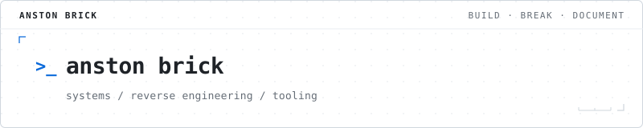

<picture>
  <source media="(prefers-color-scheme: dark)" srcset="assets/header-dark.svg">
  <source media="(prefers-color-scheme: light)" srcset="assets/header-light.svg">
  
</picture>

I build, break, and document software.

<table width="100%">
  <tr>
    <td width="50%" valign="top">
      <code>01 / systems</code>  
      Linux and systems
    </td>
    <td width="50%" valign="top">
      <code>02 / reversing</code>  
      Reverse engineering / software archaeology
    </td>
  </tr>
  <tr>
    <td width="50%" valign="top">
      <code>03 / tooling</code>  
      Developer tooling and automation
    </td>
    <td width="50%" valign="top">
      <code>04 / hardware</code>  
      Hardware and embedded-ish things
    </td>
  </tr>
  <tr>
    <td colspan="2" valign="top">
      <code>05 / miscellaneous</code>  
      Making computers do things they probably weren't intended to do
    </td>
  </tr>
</table>

> [!NOTE]
> Most of my active work and experiments live in private repositories.
